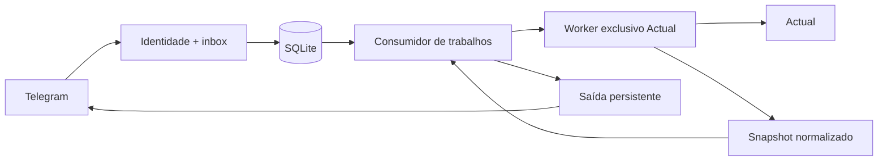

# Arquitetura e contratos

Polling, consumo de trabalhos, saída de mensagens e manutenção têm loops separados. Há um consumidor local de comandos e um executor Actual serial. Uma chamada lenta ao SDK não bloqueia a persistência de novas mensagens. Erro fatal de loop cancela os demais antes de fechar o estado.

## Interfaces de extensão

- `validateConfig(input, baseDir)` / `loadConfig(filename)`: configuração validada e congelada; erros públicos por código.
- `secretResolver(root)(reference)`: resolve somente um nome de arquivo permitido dentro da raiz; não retorna caminhos em erros.
- `identityFromConfig(config)`: `{householdId,budgetId,userId,chatId,timezone,currency}`. Toda requisição normalizada contém essa identidade.
- `authorizeUpdate(update, config)`: mensagem `{type:'message',text,identity}`, callback `{type:'callback',callbackId,data,identity}` ou `null`.
- `StateStore(filename, identity, {now})`: `acceptUpdate`, `enqueueJob`, `claimJob`, `completeJob`, `failJob`, `enqueueOutbox`, `claimOutbox`, `finishOutbox`, `recover`, preferências, snapshots, `backup`, `close`. `db` permite repositórios específicos nas fases seguintes. Transações são síncronas; rede fica fora delas.
- `new ActualClient(config)`: `snapshot({start,end})` e `close()`. SDK e seus segredos ficam no worker; a aplicação recebe dados normalizados ou códigos de erro.
- `createCommandHandler({config,store,actual,now})`: retorna função `(request,job) => Promise<{text,replyMarkup?}|null>`.
- `main({config,telegram,actual,signal,logger,handlerFactory})`: injeções opcionais para testes e casos de uso posteriores.

## Snapshot

O snapshot contém `id`, `householdId`, `budgetId`, `period:{start,end}` inclusivo, `timezone`, `currency`, `syncedAt`, `createdAt`, `rulesVersion`, `coverage:{complete,failedAccountIds}` e:

| Lista | Campos |
| --- | --- |
| `accounts` | `id,name,offBudget,closed,balance` (saldo acumulado até `period.end`, não a soma apenas do período) |
| `categories` | `id,name,groupId,isIncome,hidden` |
| `payees` | `id,name,transferAccountId` |
| `transactions` | `id,accountId,date,amount,payeeId,notes,categoryId,parentId,isParent,isChild,transferId,cleared` |
| `budgetMonths` | `month,totalBudgeted,totalSpent,totalBalance,categories` com campos normalizados do orçamento |

Valores monetários são inteiros seguros em centavos. Ausência de categoria vira `null`. Splits agrupados retornados pelo SDK são achatados uma única vez; o pai fica marcado, para permitir rastreio e exclusão explícita nos cálculos. Transferências não representam consumo doméstico. Uma falha de conta marca cobertura incompleta; nenhum total completo pode ser emitido a partir dela.

O SDK é inicializado uma vez por worker, abre apenas o orçamento configurado e sincroniza explicitamente antes da leitura. A fila impede leituras concorrentes dentro desse cache; isso não promete uma transação distribuída contra outras instâncias do Actual. Timeout encerra o worker e só permite criar outro após a terminação confirmada. Se a terminação falhar, o cliente permanece indisponível até reinicialização supervisionada.

## Estado e exclusividade

`state.sqlite` usa WAL, chaves estrangeiras e transações curtas. Inbox, cursor e job são gravados juntos. Conclusão e todas as partes da resposta são gravadas na mesma transação. Payloads têm limites de tamanho; metadados de deduplicação permanecem depois da retenção do conteúdo.

O cursor Telegram é vinculado ao ID do bot. Como os IDs podem reiniciar aleatoriamente após uma semana sem updates e o servidor os retém por no máximo 24h, depois de 48h sem recebimentos a aplicação consulta novamente a partir de zero. A primeira nova update abre uma época de deduplicação persistida; `(epoch,update_id)` e a chave do trabalho evitam colisão com o histórico anterior. O intervalo de 48h é uma escolha conservadora para antecipar a fronteira de uma semana. [Contrato Telegram](https://core.telegram.org/bots/api#update)

Um banco **separado**, `runtime-lock.sqlite`, mantém `BEGIN EXCLUSIVE` em modo de rollback por toda a vida do processo. Outra instância não pode obter o mesmo lock. O SO/SQLite libera o lock quando a conexão/processo fecha; não é necessário apagar arquivo após crash. Não coloque esse volume em NFS nem compartilhe o cache com outro programa. Contratos: [transações SQLite](https://www.sqlite.org/lang_transaction.html), [locks SQLite](https://www.sqlite.org/lockingv3.html).

Na recuperação: job de leitura em execução volta à fila; trabalho não repetível vira incerto; saída em envio vira incerta. A outbox não promete entrega exatamente uma vez no Telegram, que não fornece chave de idempotência para `sendMessage`.

Saídas para o mesmo chat têm intervalo mínimo de 1,1s, persistido. Uma resposta explícita `429` com `retry_after` inteiro de 1 a 3600 segundos pode reagendar a mensagem, até cinco tentativas totais. Um timeout ou resposta ambígua permanece incerto e não entra nessa repetição.

## Fontes dos contratos fixados

- [Actual API v26.9.0 — métodos](https://github.com/actualbudget/actual/blob/v26.9.0/packages/api/methods.ts), [handlers](https://github.com/actualbudget/actual/blob/v26.9.0/packages/loot-core/src/server/api.ts).
- [Telegram — getUpdates](https://core.telegram.org/bots/api#getupdates), [getMe](https://core.telegram.org/bots/api#getme), [getWebhookInfo](https://core.telegram.org/bots/api#getwebhookinfo), [sendMessage](https://core.telegram.org/bots/api#sendmessage).
- [better-sqlite3 — transações e backup](https://github.com/WiseLibs/better-sqlite3/blob/master/docs/api.md).
