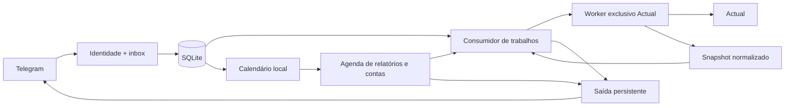

# Arquitetura e contratos

Polling, roteamento, consumo de trabalhos, saída de mensagens e manutenção têm loops separados. O Telegram é consultado uma vez; um ledger durável escolhe o perfil ativo e encaminha cada update para um runtime com SQLite, schedulers, cache e worker Actual exclusivos. A entrega é serializada globalmente entre perfis. Uma falha de integração em um perfil não bloqueia os demais, e um erro fatal do ledger cancela os loops antes de fechar todos os estados. A composição está em [main](../src/main.mjs), no [runtime multi-base](../src/jobs/multi-runtime.mjs) e no [router](../src/telegram/base-router.mjs).

## Interfaces de extensão

- `validateConfig(input, baseDir)` / `loadConfig(filename)`: configuração validada e congelada; erros públicos por código.
- `ChatProviders(config,{fetchImpl,resolveSecret})`: HTTP nativo para Ollama/Gemini, `complete` e `listModels`, limites de corpo/contexto/prazo e metadados observados. Não executa ferramentas. Estado nativo com signatures/thinking permanece transitório e restrito ao mesmo provedor/modelo.
- `ConversationService({config,store,actual,now,providers,financeTools})`: coordena histórico limitado, seleção de resultados, consentimento cloud e rodadas de ferramentas. `FinanceTools` expõe consultas fechadas e preparação de propostas; `AssistantActions` executa somente depois da confirmação autenticada. [Contrato, limites e aceite](conversation.md).
- `secretResolver(root)(reference)`: resolve somente um nome de arquivo permitido dentro da raiz; não retorna caminhos em erros.
- `identityFromConfig(config)`: `{householdId,budgetId,userId,chatId,timezone,currency}`. Toda requisição normalizada contém essa identidade.
- `authorizeUpdate(update, config)`: mensagem `{type:'message',text,identity}`, callback `{type:'callback',callbackId,data,identity}` ou `null`.
- `StateStore(filename, identity, {now})`: `acceptUpdate`, `enqueueJob`, `claimJob`, `completeJob`, `failJob`, `enqueueOutbox`, `claimOutbox`, `finishOutbox`, `recover`, preferências, snapshots, `backup`, `close`. `OperationJournal` usa `db` para propostas, operações, itens, exemplos e eventos. Transações são síncronas; rede fica fora delas.
- `new ActualClient(config)`: `snapshot({start,end})`, `readSchedules()`, `inspectTransaction(targetId)`, `inspectCategoryCatalog()`, `changeCategory(input)`, `createCategory(input)` e `close()`. São operações de domínio fechadas; nenhum método arbitrário do SDK é encaminhado. SDK e seus segredos ficam no worker; a aplicação recebe dados normalizados, códigos ou resultado de mutação.
- `createCommandHandler({config,store,actual,now,intentClient?,actionService?,billService?,reportScheduler?})`: retorna função `(request,job) => Promise<{text,replyMarkup?,dedupeKey?,metadata?}|null>`. Categorização e callbacks passam por `CategorizationActions`; recorrências e callbacks próprios passam por `BillService`; consultas seguem interpretação e cálculo locais.
- `OperationJournal(store)`: cria propostas idempotentes por job, consome aprovação/reserva operação, registra conclusão com feedback/outbox e reconcilia observações sem repetir a escrita.
- `BillService({config,store,actual,now})`: comandos locais, propostas, materialização de calendário, `refresh()` de evidências e `getUpcoming({from,to})`. `BillStore` persiste unidades, versões, atribuições, candidatos, ocorrências, observações, propostas e eventos.
- `Schedulers([report,bill])`: compõe `tick`, `owns`, `runJob`, `authorizeDelivery` e `prune`. `BillScheduler` produz lembretes usando apenas o estado local e agenda o job `bill_reconcile` para leitura separada. `ReportScheduler` recebe `upcomingProvider` ligado a `BillService.getUpcoming`.
- `backupState(store,{config,operationId})` e `writeEncryptedBackup(bytes,{config,operationId,kind})`: retornam referência autenticável do arquivo cifrado; falha impede o patch. [Formato e retenção](backups.md).
- `main({config,telegram,actual,signal,logger,handlerFactory})`: injeções opcionais para testes e casos de uso posteriores.

## Snapshot

O snapshot contém `id`, `householdId`, `budgetId`, `period:{start,end}` inclusivo, `timezone`, `currency`, `syncedAt`, `createdAt`, `rulesVersion:'1'`, `transactionMetadataVersion:'1'`, `coverage:{complete,failedAccountIds}` e:

| Lista | Campos |
| --- | --- |
| `accounts` | `id,name,offBudget,closed,balance` (saldo acumulado até `period.end`, não a soma apenas do período) |
| `categories` | `id,name,groupId,isIncome,hidden` |
| `categoryGroups` | `id,name,isIncome,hidden`; permite distinguir categorias homônimas e identificar grupos ocultos |
| `payees` | `id,name,transferAccountId` |
| `transactions` | `id,accountId,date,amount,payeeId,notes,categoryId,parentId,isParent,isChild,transferId,cleared,reconciled,startingBalance,scheduleId` |
| `budgetMonths` | `month,totalBudgeted,totalSpent,totalBalance,categories` com campos normalizados do orçamento |

Valores monetários são inteiros seguros em centavos. Ausência de categoria vira `null`. Splits agrupados retornados pelo SDK são achatados uma única vez; o pai fica marcado, para permitir rastreio e exclusão explícita nos cálculos. Transferências não representam consumo doméstico. Uma falha de conta marca cobertura incompleta; nenhum total completo pode ser emitido a partir dela.

Caches anteriores sem `transactionMetadataVersion` continuam válidos para consultas financeiras compatíveis, mas não autorizam nova evidência de recorrência. `readSchedules()` retorna envelope `schedules-1` com identidade, horários, cobertura e catálogo normalizado; preserva regras SDK sem inferir pagamento ou expandi-las no calendário mensal. [Contrato completo e prova do SDK](actual-contract.md#leitura-de-agendas-e-metadados-de-transações).

O SDK é inicializado uma vez por worker, abre apenas o orçamento configurado e sincroniza explicitamente antes da leitura. A fila impede leituras concorrentes dentro desse cache; isso não promete uma transação distribuída contra outras instâncias do Actual. Timeout encerra o worker e só permite criar outro após a terminação confirmada. Se a terminação falhar, o cliente permanece indisponível até reinicialização supervisionada.

## Inspeção e escrita de categoria

`inspectTransaction(targetId)` sincroniza e retorna `{context,transaction,account,payee,categories,categoryGroups,fingerprint,eligibility,syncedAt}`. `context` contém residência e orçamento. A transação canônica inclui os mesmos `reconciled`, `startingBalance` e `scheduleId` dos snapshots novos; o fingerprint cobre o contexto e todos esses campos. A elegibilidade distingue splits, transferências, saldo inicial, contas encerradas/fora do orçamento e dados ambíguos. Na inspeção, `categories.hidden` combina a visibilidade da categoria e do grupo; no snapshot, as listas mantêm suas flags próprias.

`changeCategory({operationId,targetId,expectedFingerprint,categoryId,expectedCategory,context})` aceita apenas essa forma. `expectedCategory` contém `{id,name,groupId,isIncome,hidden}` do destino aprovado; para restaurar categoria nula, ambos `categoryId` e `expectedCategory` são `null`. O resultado é `{status:'applied'|'failed_before'|'uncertain',code,before?,after?,beforeFingerprint?,afterFingerprint?,backupRef?,verifiedAt?}`. `applied` exige resultado coerente e backup, releitura e sync verificados. O patch no SDK contém somente `{category: categoryId}`.

A proposta dura 15 minutos e não escreve. Sua confirmação consome o nonce, reserva operação/item, bloqueia a repetição do job e persiste o aviso inicial em uma transação. A aplicação faz backup cifrado do estado SQLite; o executor faz export cifrado do Actual, sincroniza e revalida antes de um único patch. Um resultado incerto aposenta o worker antes de outra chamada, evitando que uma escrita assíncrona ultrapasse o prazo e continue num cache reutilizado. [Contrato testado e limites do SDK](actual-contract.md).

Conclusão da operação, feedback e mensagem final ficam no mesmo commit. Reconciliação somente relê: resultados originalmente incertos podem virar `observed_before` ou `observed_after`, mantendo `initial_outcome` e eventos de origem. Desfazer cria outra proposta para restaurar apenas a categoria anterior, com nova confirmação e guarda de fingerprint/linhagem. Detalhes de identidade, estados e retenção estão em [autorização](authorization.md).

## Estado e exclusividade

A conversa usa memória limitada no SQLite (padrão até 24h/12 turnos, também limitada por bytes), seleção numerada e consentimentos por contexto. Pensamentos/assinaturas nativas não são histórico persistido. As propostas de lote têm journal separado e resultado por item: criação de categoria ou itens aplicados podem permanecer se outro item falhar. O commit local não torna o conjunto de RPCs Actual atômico. `/ia limpar` não apaga outbox, journal, backups ou mensagens já entregues.

`state.sqlite` usa WAL, chaves estrangeiras e transações curtas. Inbox, cursor e job são gravados juntos. Conclusão e todas as partes da resposta são gravadas na mesma transação. Payloads têm limites de tamanho; metadados de deduplicação permanecem depois da retenção do conteúdo.

A migração [004](../migrations/004_bills.sql) acrescenta o estado de recorrências sem substituir as tabelas 001–003. Confirmação local reúne mudança, consumo da proposta, auditoria e resposta final na mesma transação. Não exige RPC de escrita nem backup pré-patch; esse último pertence à categorização no Actual. O backup operacional do SQLite protege também o calendário, versões e pagamentos declarados manualmente.

Ocorrências têm identidade estável por cadastro/competência. Versões efetivas, overrides e estados locais são separados de observações de lançamentos. Alterar atribuição, revisão ou contexto de concorrência invalida a evidência dependente; um novo confronto completo é necessário. O domínio recebe todas as ocorrências concorrentes da janela, inclusive anteriores a qualquer consulta de calendário. [Regras puras](recurrence-domain.md) e [fluxo da aplicação](recurrences.md).

O cursor Telegram é vinculado ao ID do bot. Como os IDs podem reiniciar aleatoriamente após uma semana sem updates e o servidor os retém por no máximo 24h, depois de 48h sem recebimentos a aplicação consulta novamente a partir de zero. A primeira nova update abre uma época de deduplicação persistida; `(epoch,update_id)` e a chave do trabalho evitam colisão com o histórico anterior. O intervalo de 48h é uma escolha conservadora para antecipar a fronteira de uma semana. [Contrato Telegram](https://core.telegram.org/bots/api#update)

Um banco **separado**, `runtime-lock.sqlite`, mantém `BEGIN EXCLUSIVE` em modo de rollback por toda a vida do processo. Outra instância não pode obter o mesmo lock. O SO/SQLite libera o lock quando a conexão/processo fecha; não é necessário apagar arquivo após crash. Não coloque esse volume em NFS nem compartilhe o cache com outro programa. Contratos: [transações SQLite](https://www.sqlite.org/lang_transaction.html), [locks SQLite](https://www.sqlite.org/lockingv3.html).

Na recuperação: job de leitura em execução volta à fila; confirmação cuja operação e resposta final já foram persistidas termina sem reexecutar o caso de uso. Demais trabalhos não repetíveis e operações reservadas/em execução viram incertos; a mensagem de recuperação é persistida. Saída em envio vira incerta. A outbox persiste PNG limitado junto da legenda textual e usa `sendPhoto`; rejeição explícita da foto permite uma única tentativa de `sendMessage`, enquanto resultado incerto nunca é repetido como texto. A outbox não promete entrega exatamente uma vez no Telegram, que não fornece chave de idempotência remota.

Saídas para o mesmo chat têm intervalo mínimo de 1,1s, persistido. Uma resposta explícita `429` com `retry_after` inteiro de 1 a 3600 segundos pode reagendar a mensagem, até cinco tentativas totais. Um timeout ou resposta ambígua permanece incerto e não entra nessa repetição.

## Fontes dos contratos fixados

- [Actual API v26.9.0 — métodos](https://github.com/actualbudget/actual/blob/v26.9.0/packages/api/methods.ts), [handlers](https://github.com/actualbudget/actual/blob/v26.9.0/packages/loot-core/src/server/api.ts).
- [Telegram — getUpdates](https://core.telegram.org/bots/api#getupdates), [getMe](https://core.telegram.org/bots/api#getme), [getWebhookInfo](https://core.telegram.org/bots/api#getwebhookinfo), [sendMessage](https://core.telegram.org/bots/api#sendmessage) e [sendPhoto](https://core.telegram.org/bots/api#sendphoto).
- [better-sqlite3 — transações e backup](https://github.com/WiseLibs/better-sqlite3/blob/master/docs/api.md).
